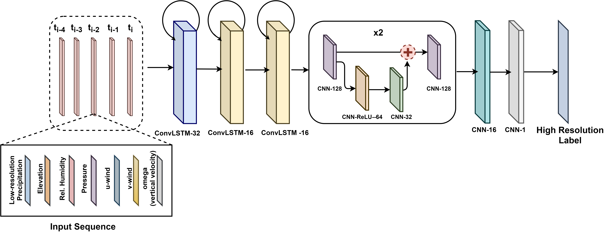

# Augmented Convolutional LSTMs for Generation of High-Resolution Climate Change Projections

The code in this repositoy contains implementation of Statistical Downscaling using an Augmented Convolutional LSTM based architecture.

## Augmented Conv LSTM Architecture 


## Dependencies
The current codebase is entirely written in Python3. The user must the following packages:
* Tensorflow (recommended =1.13)
* h5py
* matplotlib
* ConfigParser

## Data
* The coarse resolution precipitation outputs used, could be obtained from NCAR Community Earth System Model available in the archives of the [Climate Modeling Intercomparison Project](https://esgf-node.llnl.gov/projects/cmip5/). 
* For the auxilliary climatic variables, we have used Pressure, Relative Humidity, Wind (all 3-components) obtained from the national Centers for Environmental Prediction-National Center for Atmospheric Research [(NCEP-NCAR) global reanalysis project](https://www.esrl.noaa.gov/psd/data/gridded/data.ncep.reanalysis.html). 
* For topographical elevation information, we have used data from NASA’s [Shuttle Radar Topography Mission (SRTM)](https://www2.jpl.nasa.gov/srtm/), which is available at 90 meters resolution.

## Usage
>Place all the data mentioned in the above section in their respective folders nested inside the `./data` directory.

### Quick Look 
```shell
$ python preprocess_data.py
$ python train.py  
```
### Configuration File
`config.ini` provides configuration allowing setting options such file directories, model parameters, and data specification required for the preprocessing of climatic variables in `preprocess_data.py` and model training in `model.py` and `train.py`. 
### Train File Usage:
```shell
$ python train.py [--mode] [--model_type] [--batch_size] [--use_gpu]
```

1. **--mode** = `train \ test`

2. **--model_type** = `monsoon \ non_monsoon`

3. **--batch_size** = `int (default: 15)`

4. **--use_gpu** = `bool (default: False)`


